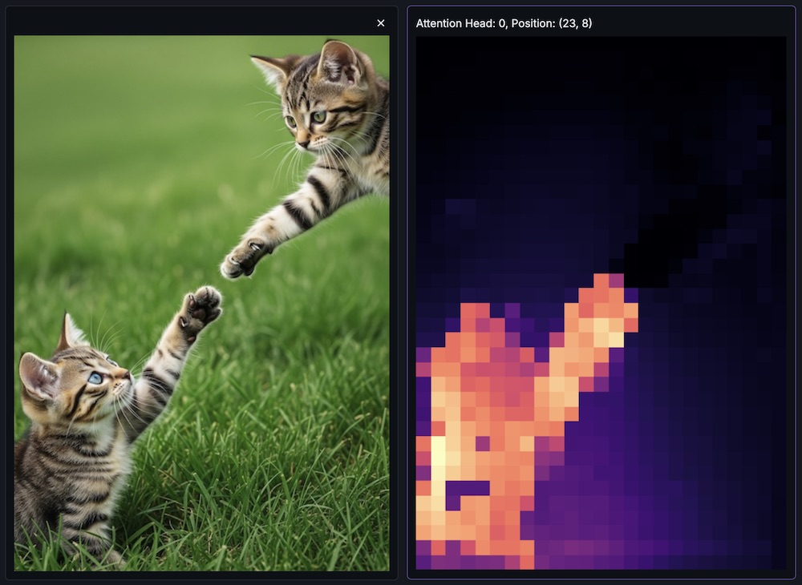

  
  <h1 align="center">Visualizing Attention</h1>

This script accompanies the [Visualizing Attention in Detection Transformer using Python](https://www.youtube.com/watch?v=UK6c8dLJ-K4) video on YouTube.

The self attention in the [Detection Transformer](https://arxiv.org/abs/2005.12872) model (DETR) appears to learn semantic instance separation. This script interactively visualizes these self-attention maps from the transformer's final encoder layer.

## Requirements

- HuggingFace's [transformers](https://huggingface.co/docs/transformers/index)
- [Scripton Python IDE](https://scripton.dev) and its built-in [Canvas toolkit](https://docs.scripton.dev/api/visualize/canvas/overview)

## References

- [End-to-End Object Detection with Transformers](https://arxiv.org/abs/2005.12872) 
